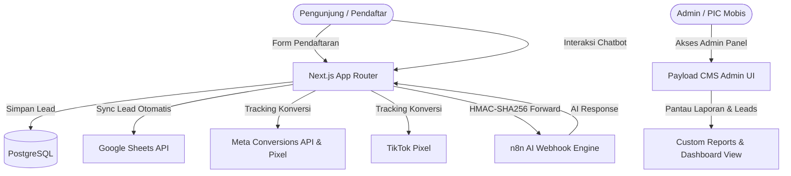

# 🚗 Laporan Analisis & Dokumentasi Arsitektur Web Mobis

Dokumen ini menyajikan analisis menyeluruh terhadap struktur kode, arsitektur sistem, alur data, integrasi eksternal, dan fitur-fitur yang ada di dalam repository **`web-mobis`** (Mobis Revamp).

---

## 📌 1. Ringkasan Eksekutif (Executive Summary)

* **Nama Proyek:** Mobis Revamp (`mobis-revamp`)
* **Tujuan Aplikasi:** Platform web landing page & portal pendaftaran sewa mobil (khususnya untuk pengemudi taksi online dan sewa personal/perusahaan), lengkap dengan integrasi CMS, pelacakan promosi/voucher, sinkronisasi Google Sheets, AI Chatbot (n8n), dan Dashboard Analytics internal.
* **Tech Stack Utama:**
  * **Framework:** Next.js 15+ (App Router) & React 19
  * **CMS Backend:** Payload CMS 3.73.0 (Full TypeScript)
  * **Database:** PostgreSQL via `@payloadcms/db-postgres`
  * **Rich Text Editor:** Lexical Editor (`@payloadcms/richtext-lexical`)
  * **Styling:** SCSS kustom (Bootstrap 5.3) + Tailwind CSS 4 + Lucide Icons + Radix UI
  * **Testing:** Vitest (Integration) & Playwright (E2E)

---

## 🏗️ 2. Arsitektur & Struktur Direktori

Repository ini mengadopsi pola monolitik modern berbasis **Next.js App Router** yang mengintegrasikan Frontend Publik dan Backend CMS Admin dalam satu runtime.

```
web-mobis/
├── docs/                      # Dokumentasi teknis (API spec chatbot, CI/CD, Lighthouse)
├── public/                    # Aset statis gambar, logo, favicon
├── scripts/                   # Skrip utilitas migrasi media & helper data
├── src/
│   ├── app/
│   │   ├── (frontend)/        # Rute publik Next.js (Halaman dinamis, [slug], post, search)
│   │   └── (payload)/         # Rute Payload CMS Admin (/admin) & API Proxy (/api/*)
│   ├── access/                # Fungsi Access Control (RBAC, adminOnly, authenticated, dll)
│   ├── blocks/                # Blok komponen konten modular untuk Payload CMS & Frontend
│   │   ├── Mobis/             # Blok spesifik bisnis Mobis (Form pendaftaran, armada, FAQ, dll)
│   │   └── ...                # Blok standar (Banner, CTA, Media, Content, Form)
│   ├── collections/           # Definisi schema koleksi Payload CMS
│   │   ├── Customers/         # Data pendaftar / prospek sewa
│   │   ├── VoucherPromo/      # Manajemen kupon voucher & log redeem
│   │   ├── Users/             # User & otentikasi admin
│   │   ├── Pages/             # Halaman dinamis CMS
│   │   ├── Posts/             # Blog artikel
│   │   ├── Categories/        # Kategori artikel / armada
│   │   ├── Media/             # Media upload gambar & dokumen
│   │   └── Registrations.ts   # Model pendaftaran tambahan
│   ├── components/            # Komponen UI React (Admin & Frontend)
│   │   ├── Dashboard/         # Custom Dashboard view untuk admin
│   │   ├── Reports/           # Advanced Analytics & Visual Reporting
│   │   ├── MobisWidget/       # Widget melayang (Chatbot, Cek Status, WA CTA)
│   │   └── ...                # Komponen UI umum (Cards, Media, Form UI)
│   ├── globals/               # Pengaturan Global CMS (Header, Footer, MobisWidgets)
│   ├── hooks/                 # Lifecycle hooks Payload (Revalidasi cache, auto slug, format)
│   ├── lib/                   # Database helpers (resync PostgreSQL sequence)
│   ├── plugins/               # Payload plugins (SEO, Redirects, NestedDocs, Search, FormBuilder)
│   ├── services/              # Layanan eksternal (Google Sheets API & Meta CAPI)
│   └── utilities/             # Helper fungsi URL, format mata uang, sanitasi input
```

---

## 🗄️ 3. Skema Data & Koleksi Payload CMS

| Koleksi / Global | Slug | Fungsi & Keterangan |
| :--- | :--- | :--- |
| **Users** | `users` | Autentikasi dan hak akses pengelola admin (RBAC: `admin`, `editor`, `user`). |
| **Media** | `media` | Manajemen aset file dan gambar dengan kompresi otomatis WebP via `sharp`. |
| **Pages** | `pages` | Halaman statis/dinamis berbasis blok (Block-based builder) dengan live preview. |
| **Posts** | `posts` | Artikel & edukasi sewa mobil terindeks SEO dan pencarian. |
| **Categories** | `categories` | Hirarki taksonomi menggunakan `nestedDocsPlugin`. |
| **Customers** | `customers` | Menyimpan data prospek lengkap dari form registrasi: NIK KTP, No. SIM, domisili, akun driver online, unit mobil pilihan, tracking voucher, hingga backup `rawPayload` JSON & `sheetMeta`. |
| **Vouchers** | `vouchers` | Master voucher diskon / promo dengan kuota, masa berlaku, dan validasi kode. |
| **VoucherCategories** | `voucher-categories` | Kategori penempatan promo voucher. |
| **VoucherRedemptions**| `voucher-redemptions`| Riwayat penggunaan voucher oleh pendaftar. |
| **Header & Footer** | *Global* | Pengaturan navigasi, menu, kontak, dan tautan sosial media. |
| **MobisWidgetsGlobal**| *Global* | Pengaturan konfigurasi widget melayang (Chatbot, WA CTA, Cek Status Pendaftaran). |

---

## ⚡ 4. Alur Bisnis & Fitur Utama

### A. Alur Pendaftaran Pengemudi / Pelanggan (`RegistrationFlow` & `RegistrationForm`)
1. Pengguna memilih program sewa (Driver Online / Mingguan / Bulanan) dan unit kendaraan yang tersedia.
2. Pengguna mengisi form pendaftaran multi-langkah (Data diri, KTP, SIM, Alamat, Kontak Darurat, Akun Aplikasi Driver).
3. Form memvalidasi kode promo/voucher secara real-time ke `/api/voucher/apply`.
4. Saat submit:
   * Data disimpan ke koleksi database PostgreSQL (`customers`).
   * Data dikirim langsung ke tab Google Spreadsheet cabang terkait via Google Sheets Service (`appendLead.ts`).
   * Mengirimkan event konversi pemasaran ke Meta Conversion API (`sendConversionsApiEvent.ts`) dan TikTok Pixel.
   * Mengembalikan respons sukses ke user beserta ringkasan pendaftaran.

### B. Widget Melayang & AI Assistant (`MobisWidget` & `/api/assistant`)
1. **Floating Hub:** Menyediakan tombol cepat WhatsApp, Cek Status Pendaftaran, dan Chatbot AI.
2. **AI Chatbot Proxy (`/api/assistant`):**
   * Menerima pesan dari pelanggan, melakukan validasi anti-XSS dan rate-limiting.
   * Mengirim request aman ke webhook upstream **n8n** menggunakan enkripsi HMAC-SHA256 (`X-Signature` & `X-Timestamp`).
   * Menjaga session conversation context token.
3. **Rating & Feedback (`/api/assistant/rating`):** Mengumpulkan bintang ulasan dan review setelah percakapan selesai.
4. **Cek Status Pendaftaran (`/api/widget/status-check`):** Pendaftar dapat mengecek status proses pengajuan cukup dengan memasukkan Nomor HP atau NIK KTP.

### C. Dashboard & Analytics Internal Admin (`src/components/Reports`)
Admin CMS memiliki custom view komprehensif:
* **Dashboard Panel:** Ringkasan pendaftar terbaru secara real-time.
* **Reports Analytics:**
  * Grafik tren pendaftaran harian/mingguan/bulanan.
  * Distribusi pendaftar berdasarkan unit mobil yang paling diminati.
  * Sebaran demografi & domisili area operasional.
  * Kinerja efektivitas penggunaan kode voucher / promo.
  * Fitur ekspor data laporan (CSV/Excel/JSON).

---

## 🔌 5. Integrasi Layanan Eksternal



1. **Google Sheets Integration:** Menggunakan `googleapis` dengan Service Account JSON / Environment Variables untuk otomatis menambahkan baris leads berdasarkan cabang/area.
2. **Meta Conversions API (CAPI):** Melacak event *Lead*, *SubmitApplication*, dan *Contact* secara server-side untuk memastikan akurasi data analitik iklan.
3. **n8n Workflow Webhook:** Otomatisasi AI customer support dengan verifikasi keamanan HMAC.

---

## 🛡️ 6. Keamanan & Best Practices yang Diterapkan

1. **Transaction & Access Control Safety:**
   * Access control yang ketat pada Payload API (`overrideAccess: false` saat impersonasi pengguna).
   * Koleksi `customers` dikunci agar `create` publik hanya melalui handler terenkapsulasi di API route dengan validasi data ketat.
2. **Keamanan API & Webhook:**
   * Rate limiting pada endpoint asisten dan registrasi.
   * HMAC-SHA256 signature verification untuk mencegah tampering pada komunikasi chatbot upstream.
3. **Database Integrity:**
   * Penyesuaian sequence auto-increment PostgreSQL saat CMS diinisialisasi (`resyncPostgresSequencesOnInit`) untuk mencegah ID collision setelah import/migrasi.
4. **Optimasi Performa & SEO:**
   * Next.js static metadata, dynamic sitemap generator (`next-sitemap`), dan Lexical SEO plugin.
   * Konversi gambar otomatis ke WebP ukuran optimal via `sharp`.

---

## 🚀 7. Kesimpulan & Rekomendasi Pengembangan

Kode pada proyek **`web-mobis`** terstruktur dengan sangat rapi dan memenuhi standar arsitektur enterprise Next.js + Payload CMS v3. Integrasi antara form pendaftaran, sinkronisasi Google Sheets, webhook AI n8n, dan modul pelaporan analitik admin bekerja secara sinergis dan aman.
