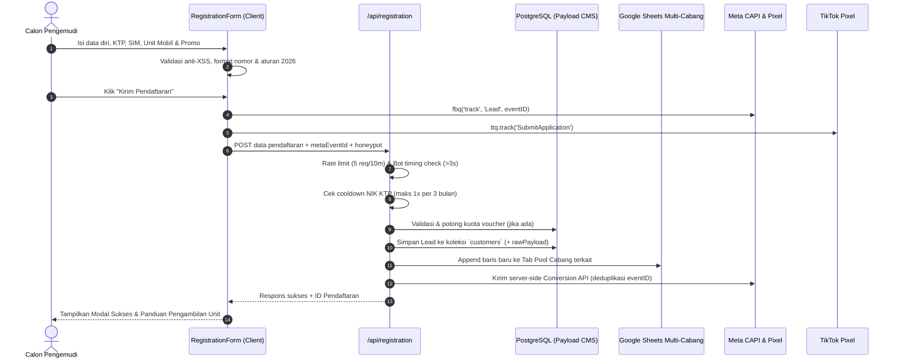

# 🚗 Laporan Analisis Menyeluruh & Dokumentasi Arsitektur Web Mobis

> **Dokumen Resmi Analisis Basis Kode (Codebase Architecture & System Review)**  
> **Proyek:** Mobis Revamp (`web-mobis` / `rentalmobis.com`)  
> **Target:** Frontend Portal, CMS Admin, Lead Engine, Analytics, AI Assistant, & CI/CD Pipeline  
> **Terakhir Diperbarui:** September 2026

---

## 📑 Daftar Isi

1. [Ringkasan Eksekutif & Karakteristik Sistem](#1-ringkasan-eksekutif--karakteristik-sistem)
2. [Peta Arsitektur & Struktur Direktori Komprehensif](#2-peta-arsitektur--struktur-direktori-komprehensif)
3. [Konfigurasi Inti & Integrasi Next.js + Payload CMS](#3-konfigurasi-inti--integrasi-nextjs--payload-cms)
4. [Skema Database & Koleksi Payload CMS (Data Layer)](#4-skema-database--koleksi-payload-cms-data-layer)
5. [Mesin Pendaftaran & Integrasi Layanan (Core Business Flow)](#5-mesin-pendaftaran--integrasi-layanan-core-business-flow)
   - 5.1 Alur Registrasi Frontend (`RegistrationForm`)
   - 5.2 Pemrosesan Backend & Proteksi Anti-Bot (`/api/registration`)
   - 5.3 Sinkronisasi Google Sheets Multi-Cabang (`appendLead.ts`)
   - 5.4 Pelacakan Konversi Iklan (Meta CAPI, TikTok & Google Tag)
   - 5.5 Manajemen & Validasi Kupon Promo (`/api/voucher`)
6. [Sistem Widget Interaktif & AI Chatbot (`MobisWidget`)](#6-sistem-widget-interaktif--ai-chatbot-mobiswidget)
   - 6.1 Arsitektur Lazy Provider
   - 6.2 Proxy Chatbot AI Aman & Integrasi n8n (`/api/assistant`)
   - 6.3 Pengecekan Status Pengajuan Mandiri (`/api/widget/status-check`)
7. [Dashboard Analisis & Laporan Bisnis Internal (`Reports Engine`)](#7-dashboard-analisis--laporan-bisnis-internal-reports-engine)
8. [Arsitektur Konten Modular (Blocks System)](#8-arsitektur-konten-modular-blocks-system)
9. [Manajemen Media, Desain Responsif & Optimasi Core Web Vitals](#9-manajemen-media-desain-responsif--optimasi-core-web-vitals)
10. [Keamanan Siber & Ketahanan Sistem (Security Architecture)](#10-keamanan-siber--ketahanan-sistem-security-architecture)
11. [Pipeline CI/CD, Containerization & Deployment](#11-pipeline-cicd-containerization--deployment)
12. [Analisis Status Git & Panduan Penyelesaian Konflik Pull](#12-analisis-status-git--panduan-penyelesaian-konflik-pull)

---

## 1. Ringkasan Eksekutif & Karakteristik Sistem

**Web Mobis** adalah platform portal publik sekaligus sistem manajemen operasional pendaftaran sewa kendaraan (*driver online* & perseorangan) milik PT Global Mobility Service (GMS) Indonesia.

### Karakteristik Utama Sistem:
* **Monolitik Modern:** Menyatukan frontend performa tinggi (Next.js App Router) dan panel admin manajemen konten/leads (Payload CMS v3) dalam satu repository dan satu deployment runtime Node.js.
* **Dual Database Management:** Menggunakan PostgreSQL sebagai *single source of truth* relasional, dengan sinkronisasi instan ke Google Sheets untuk kemudahan operasional tim cabang di lapangan.
* **Enterprise Security Standards:** Penerapan Content Security Policy (CSP) ketat, anti-CSRF/CORS terisolasi, enkripsi HMAC-SHA256 untuk webhook upstream AI, in-memory rate limiting, dan filter anti-XSS.
* **Performa Ekstrem (Core Web Vitals):** Nilai audit Google Lighthouse mencapai **90+ (Performance)**, **93 (Accessibility)**, **100 (Best Practices)**, dan **100 (SEO)** pada perangkat mobile, dengan optimasi WebP otomatis, responsif `srcSet`, dan sinkronisasi preload LCP.

### Tech Stack Detail:
* **Core Framework:** Next.js 15/16 (App Router) + React 19
* **Headless CMS Engine:** Payload CMS 3.73.0 (Full TypeScript)
* **Database Driver:** `@payloadcms/db-postgres` (PostgreSQL 15+)
* **Rich Text Engine:** Lexical Editor (`@payloadcms/richtext-lexical`)
* **Styling & CSS:** SCSS kustom modular + Bootstrap 5.3 + Tailwind CSS v4 + Radix UI Primitives + Lucide Icons + Native SVG
* **Integrasi Eksternal:** Google Sheets API (`googleapis`), Meta Graph & Conversions API (CAPI), TikTok Pixel, Google Tag Manager (GTM) / Google Analytics 4, n8n AI Workflow
* **Testing:** Vitest (Integration Testing) + Playwright (End-to-End E2E Testing)
* **Infrastruktur:** Docker Multi-stage (Node Alpine Standalone) + Docker Compose + Traefik/Nginx Reverse Proxy + GitHub Actions CI/CD

---

## 2. Peta Arsitektur & Struktur Direktori Komprehensif

```
web-mobis/
├── .github/
│   ├── workflows/             # GitHub Actions CI/CD (lint, test, build, deploy)
│   └── scripts/               # remote-deploy.sh (zero-downtime container deploy)
├── docs/                      # Spesifikasi teknis (Chatbot API, CI/CD setup, Lighthouse)
├── md-agents/                 # Rencana kerja & log evolusi fitur (field mobil, form, dll)
├── public/                    # Aset statis publik (media, favicon, logo SVG murni)
├── scripts/                   # Skrip utilitas CLI (sync-media.mjs, sanitasi data)
├── src/
│   ├── access/                # Access control function RBAC (anyone, authenticated, etc.)
│   ├── app/
│   │   ├── (frontend)/        # Rute publik Next.js
│   │   │   ├── [slug]/        # Dinamis CMS landing page renderer
│   │   │   ├── posts/         # Halaman artikel & detail blog
│   │   │   ├── search/        # Halaman pencarian konten
│   │   │   ├── bootstrap-custom.scss # Custom SCSS Bootstrap (colors, grid)
│   │   │   ├── fonts.ts       # Definisi font Inter local Font Display Swap
│   │   │   ├── globals.css    # Tailwind CSS v4 directives & root variables
│   │   │   ├── layout.tsx     # Shell layout frontend (Header, Pixels, GTM, MobisWidget, Footer)
│   │   │   └── page.tsx       # Root entrypoint (redirect / fallback render)
│   │   ├── (payload)/         # Rute Payload CMS
│   │   │   ├── admin/         # UI Admin Panel (/admin) & custom views
│   │   │   └── api/           # API Endpoints internal & publik
│   │   │       ├── [...slug]/ # Payload core GraphQL/REST proxy
│   │   │       ├── assistant/ # Proxy webhook AI n8n + rating
│   │   │       ├── open/      # Endpoint laporan terbuka terotorisasi token (/reports)
│   │   │       ├── registration/ # Handler submit form pendaftaran & sinkronisasi
│   │   │       ├── voucher/   # Handler validasi & apply kupon promo
│   │   │       └── widget/    # Handler pengecekan status pendaftaran
│   │   ├── layout.tsx         # Root HTML layout (Schema.org JSON-LD structured data)
│   │   └── robots.ts          # Dynamic robots.txt generator
│   ├── blocks/                # Blok modular komponen visual
│   │   ├── Mobis/             # Blok spesifik bisnis Mobis
│   │   │   ├── About/         # Informasi profil layanan (AboutSplit)
│   │   │   ├── AreaChips/     # Pilihan pool/wilayah operasional
│   │   │   ├── BannerCarousel/# Hero banner slider full-bleed responsif
│   │   │   ├── FaqAccordion/  # Daftar pertanyaan umum (FAQ + JSON-LD)
│   │   │   ├── ProgramDual/   # Kartu program sewa (Rent-to-Own vs Reguler)
│   │   │   ├── RegistrationFlow/ # Wrapper alur pendaftaran
│   │   │   ├── RegistrationForm/ # Form input pendaftaran lengkap (1500+ baris)
│   │   │   ├── Requirements/  # Syarat & ketentuan pengemudi
│   │   │   ├── Testimonials/  # Ulasan & review driver
│   │   │   └── UnitsAvailable/# Katalog armada mobil & harga harian/mingguan
│   │   └── RenderBlocks.tsx   # Dynamic block mapper engine
│   ├── collections/           # Schema definisi Payload CMS
│   │   ├── Categories.ts      # Kategori konten berjenjang
│   │   ├── Customers/         # Data lead prospek pendaftaran mobil
│   │   ├── Media.ts           # Upload gambar/dokumen dengan resize WebP otomatis
│   │   ├── Pages/             # Halaman dinamis modular
│   │   ├── Posts/             # Artikel blog edukasi
│   │   ├── Users/             # User admin RBAC
│   │   └── VoucherPromo/      # Kupon, kuota, masa berlaku & riwayat klaim
│   ├── components/            # Komponen React (Frontend & Admin UI)
│   │   ├── BootstrapClient/   # Inisialisasi JS Bootstrap responsif dinamis
│   │   ├── Dashboard/         # Custom widget dashboard admin
│   │   ├── GoogleTag/         # Integrasi Google Tag Manager / GA4
│   │   ├── MobisWidget/       # Floating action button, Chatbot n8n, & Cek Status
│   │   ├── PixelFacebook/     # Meta Pixel client tracking
│   │   ├── PixelTiktok/       # TikTok Pixel client tracking
│   │   └── Reports/           # Full-featured Analytics & Reporting Engine (Admin)
│   ├── fields/                # Reusable fields Payload (Lexical, Slug, URL)
│   ├── globals/               # Pengaturan Global CMS (Header, Footer, Widgets)
│   ├── hooks/                 # Lifecycle hooks Payload (Revalidasi cache, slug)
│   ├── lib/                   # Business logic helpers
│   │   ├── db/                # PostgreSQL sequence resync script
│   │   ├── google/            # Google Auth client factory
│   │   ├── http/              # IP Resolver (x-forwarded-for, cf-connecting-ip)
│   │   ├── media/             # Hook kompresi Sharp sebelum simpan
│   │   ├── security/          # In-memory rate limiting, sanitasi XSS, HMAC signing
│   │   └── validation/        # Validator Zod/custom untuk form & voucher
│   ├── plugins/               # Payload plugins (SEO, Redirects, NestedDocs, Search)
│   ├── services/              # Layanan integrasi luar
│   │   ├── googleSheets/      # Append leads ke tab cabang spreadsheet
│   │   └── meta/              # Server-side Meta Conversions API (CAPI)
│   └── utilities/             # Helper URL resolver, formatting mata uang IDR
├── next.config.js             # Konfigurasi Next.js, CSP Headers, Image domains
├── package.json               # Dependensi & skrip runner
└── payload.config.ts          # Konfigurasi utama Payload CMS
```

---

## 3. Konfigurasi Inti & Integrasi Next.js + Payload CMS

### 3.1 Integrasi Arsitektur Monolitik
Diinisialisasi melalui `src/payload.config.ts` dan dihubungkan ke Next.js menggunakan `@payloadcms/next/withPayload` di `next.config.js`.

* **Database Adapter:** Menggunakan `@payloadcms/db-postgres` dengan connection pool PostgreSQL. Terdapat opsi `dbPushEnabled` yang dikontrol via variabel environment `PAYLOAD_DB_PUSH` (dinonaktifkan di production untuk mencegah mutasi skema tak terduga).
* **Auto Sequence Resync (`onInit`):** Saat server dimulai, fungsi `resyncPostgresSequencesOnInit(payload)` dijalankan (`src/lib/db/resyncPostgresSequences.ts`). Fungsi ini memeriksa seluruh ID tabel (`customers`, `vouchers`, dll.) dan menyinkronkan sequence serial Postgres ke `MAX(id)` untuk mencegah error *duplicate key violation* pasca migrasi atau seeding manual.
* **Admin UI Customization:** Panel admin `/admin` diperkaya dengan:
  - `beforeLogin`: Branding login custom Mobis.
  - `beforeNavLinks`: Tombol pintas navigasi ke halaman custom `/admin/reports`.
  - `views.dashboard`: Dashboard metriks kustom (`@/components/Dashboard`).
  - `views.reports`: Halaman laporan analitik mendalam (`@/components/Reports`).
* **Live Preview:** Mendukung breakpoint dinamis (Mobile: 375px, Tablet: 768px, Desktop: 1440px) untuk pratinjau halaman CMS secara real-time.

---

## 4. Skema Database & Koleksi Payload CMS (Data Layer)

### 4.1 Koleksi `customers` (`src/collections/Customers/Customers.ts`)
Menyimpan seluruh data pendaftar sewa armada secara komprehensif:
* **Identitas Pribadi:** `name`, `birthPlace`, `birthDate`, `phone`, `ktpNumber` (indexed), `currentAddress`, `domicile` (indexed), `houseOwnership`.
* **Legalitas Pengemudi:** `simNumber`, `simType`, `simValidUntil`.
* **Kontak Darurat:** `emergencyName`, `emergencyPhone`, `emergencyRelation`.
* **Pengalaman & Akun Driver:** `driverApps`, `activeAccountSelf`, `driverExperience`.
* **Pemilihan Unit & Lokasi:** `carUnit` (misal: Calya, Sigra, dll.), `handoverLocation` (Pool penyerahan mobil), `sourceInfo`.
* **Promo & Tracking:** `promoCode` (indexed), `promoApplied` (boolean), `promoAppliedAt`, `voucher` (relasi ke `vouchers`), `promoError`.
* **Cadangan Mutlak (Safety Vault):**
  - `rawPayload` (JSON): Menyimpan objek utuh request form dari browser. Menjamin tidak ada data yang hilang meskipun ada field skema baru yang belum terpetakan.
  - `sheetMeta` (JSON): Catatan jejak pengiriman ke Google Sheets (ID spreadsheet, nama sheet cabang, baris ke berapa, dan status kirim).
* **Hak Akses (RBAC):** `create: () => false` (hanya bisa diinsert lewat API route internal berproteksi), sedangkan `read`, `update`, `delete` mewajibkan login admin (`req.user`).

### 4.2 Koleksi Promo Voucher (`src/collections/VoucherPromo/`)
* **`vouchers`:** Master kode promo (`code`), tipe diskon (persen/nominal IDR), kuota maksimal (`maxUsage`), kuota terpakai (`usedCount`), tanggal kadaluarsa (`validUntil`), status aktif (`isActive`).
* **`voucher-categories`:** Pengelompokan jenis program promosi.
* **`voucher-redemptions`:** Audit log pencatatan setiap kali kode promo berhasil dipakai oleh `ktpNumber` dan `phone` tertentu, mencegah klaim ganda.

### 4.3 Koleksi CMS Standar
* **`pages`:** Builder halaman fleksibel berbasis layout blocks (Hero, UnitsAvailable, Form, Accordion, dll.) dengan dukungan SEO dan OpenGraph otomatis.
* **`posts` & `categories`:** Artikel edukasi driver dan berita industri sewa mobil, diintegrasikan dengan `nestedDocsPlugin` dan plugin pencarian Payload.
* **`media`:** Repositori file gambar/PDF. Dilengkapi middleware `optimizeImageUpload` (Sharp) yang meresize dan mengonversi gambar master ke WebP (kualitas 78%) serta membuat turunan ukuran thumbnail (`300w`), square (`500w`), small (`600w`), medium (`900w`), large (`1400w`), xlarge (`1920w`), dan og (`1200x630`).

---

## 5. Mesin Pendaftaran & Integrasi Layanan (Core Business Flow)

Alur pendaftaran adalah urat nadi bisnis platform ini:



### 5.1 Alur Registrasi Frontend (`RegistrationForm/Component.tsx`)
* **Pencegahan Bot Berbasis Perilaku:**
  - *Honeypot Field:* Elemen input tersembunyi yang jika terisi oleh bot otomatis akan langsung digagalkan.
  - *Submission Timing Guard:* Pendaftaran yang disubmit di bawah 3 detik sejak form dirender dianggap sebagai bot script otomatis (`MIN_HUMAN_SUBMIT_MS = 3000`).
* **Aturan Bisnis Khusus (Tahun Mobil 2026):**
  - Fungsi `isJabodetabekHandover()` mendeteksi apakah lokasi penyerahan berada di pool Kranggan, Karawaci, atau Bubulak.
  - Validasi kondisional membatasi unit keluaran terbaru (2026) hanya untuk area operasional yang memenuhi syarat.
* **Auto-Formatting & Sanitasi Real-time:** Nomor telepon, NIK, dan nomor SIM difilter secara otomatis menjadi digit numerik murni.

### 5.2 Pemrosesan Backend (`/api/registration/route.ts`)
* **Rate Limiting:** Dibatasi maksimal 5 pendaftaran per 10 menit per IP klien.
* **KTP Cooldown (3 Bulan):** Backend memeriksa riwayat pendaftaran berdasarkan NIK KTP. Jika NIK yang sama pernah mendaftar dalam kurun waktu kurang dari 3 bulan (`KTP_REAPPLY_COOLDOWN_MONTHS`), pengajuan akan ditolak dengan pesan informatif agar tidak terjadi spamming registrasi.
* **Penyimpanan Ganda yang Aman:** Data disimpan ke database Postgres terlebih dahulu. Setelah sukses, ID dokumen digunakan sebagai referensi pengiriman Google Sheets dan Meta CAPI.

### 5.3 Sinkronisasi Google Sheets Multi-Cabang (`src/services/googleSheets/appendLead.ts`)
* Menggunakan pustaka resmi `googleapis` via autentikasi Google Service Account.
* **Dynamic Routing Tab Pool:** Berdasarkan pilihan lokasi penyerahan unit (`handoverLocation`), data otomatis diarahkan ke spreadsheet dan nama lembar (*worksheet tab*) yang sesuai (misal: Tab Kranggan, Tab Karawaci, Tab Bubulak, Tab Surabaya/Sidoarjo, dll.).
* Hasil append dicatat kembali ke database di field `sheetMeta`.

### 5.4 Pelacakan Konversi Iklan (Meta CAPI, TikTok & Google Tag)
* **Deduplikasi Event (Meta Pixel vs CAPI):** Frontend membuat UUID acak `metaEventId` dan menembakkannya ke browser pixel via `fbq('track', 'Lead', ..., { eventID })`. ID yang sama dikirimkan ke backend dan diteruskan ke Meta Conversions API (`sendConversionsApiEvent.ts`). Meta mencocokkan ID ini dan menghitung konversi secara presisi tanpa hitungan ganda (*zero double counting*).
* **Hashing SHA-256 Sesuai Regulasi Privasi:** Sebelum dikirim ke Meta CAPI, data sensitif pengemudi (nama, nomor telepon dengan kode negara `62`, email) di-hash menggunakan algoritma SHA-256 di sisi server.
* **TikTok & Google Tag:** Terintegrasi di level root frontend layout (`src/app/(frontend)/layout.tsx`) untuk melacak event penayangan halaman dan interaksi pendaftaran.

---

## 6. Sistem Widget Interaktif & AI Chatbot (`MobisWidget`)

Widget melayang di pojok kanan bawah dirancang agar sangat responsif tanpa membebani performa awal halaman.

### 6.1 Arsitektur Lazy Provider (`LazyMobisWidgetProvider.tsx`)
Untuk menjaga skor *Largest Contentful Paint* (LCP) dan *Total Blocking Time* (TBT) tetap hijau, seluruh modul widget dimuat secara dinamis (*lazy dynamic import*) dengan penundaan berbasis `requestIdleCallback` atau timeout 2 detik.

### 6.2 Proxy Chatbot AI Aman & Integrasi n8n (`/api/assistant/route.ts`)
* **Upstream Protection:** Frontend klien tidak pernah berkomunikasi langsung dengan webhook n8n AI engine. Seluruh percakapan melewati proxy server Next.js di `/api/assistant`.
* **HMAC-SHA256 Signature Verification (`assistantSigning.ts`):** Setiap request yang diteruskan ke n8n ditandatangani dengan header `X-Signature` dan `X-Timestamp` menggunakan secret key `MOBIS_ASSISTANT_SECRET`. Ini mencegah pihak luar membanjiri atau memanipulasi webhook AI.
* **Anti-Tampering & XSS Check:** Teks pertanyaan pengguna difilter menggunakan `assertNoSuspiciousMarkup()` untuk mencegah injeksi script atau prompt injection berbahaya.
* **Fail-Closed Strategy:** Jika environment webhook upstream tidak diset, sistem merespons dengan pesan ramah (atau stub) tanpa membocorkan URL infrastruktur internal.
* **Sistem Rating:** Endpoint `/api/assistant/rating` mengumpulkan umpan balik kepuasan pelanggan (bintang 1-5 dan ulasan) pasca sesi obrolan selesai.

### 6.3 Pengecekan Status Pengajuan Mandiri (`/api/widget/status-check/route.ts`)
Calon pengemudi yang sudah mendaftar tidak perlu berulang kali menghubungi admin. Mereka cukup membuka modal status di widget dan memasukkan Nomor HP atau NIK KTP untuk melihat progres verifikasi berkas mereka secara real-time.

---

## 7. Dashboard Analisis & Laporan Bisnis Internal (`Reports Engine`)

Panel Admin Payload dilengkapi dengan mesin analitik kustom tingkat lanjut (`src/components/Reports/` dan `/api/open/reports/`):

* **Agregasi Waktu Fleksibel:** Menampilkan tren volume pendaftaran berdasarkan interval harian (*day*), mingguan (*week*), bulanan (*month*), hingga tahunan (*year*).
* **Distribusi Permintaan Armada:** Visualisasi grafik unit kendaraan yang paling diminati calon driver (Agya, Calya, Sigra, dll.).
* **Sebaran Demografi Wilayah:** Analisis sebaran domisili pengemudi dan pool penyerahan terpadat.
* **Efisiensi Voucher:** Menghitung rasio pendaftar yang menggunakan kode promo tertentu versus pendaftar organik.
* **Filtering Lead Uji Coba:** Menggunakan filter `isExcludedLeadName()` (`src/lib/customers/testLeadFilter.ts`) agar pendaftaran testing internal (misal: "test", "demo", "coba") tidak mengotori grafik analitik bisnis aktual.
* **Ekspor Data:** Fitur satu-klik untuk mengunduh seluruh data laporan dalam format CSV / Excel / JSON untuk kebutuhan rapat direksi.
* **Keamanan Akses Terbuka:** Endpoint `/api/open/reports` dilindungi oleh whitelist domain dan token bearer (`REPORTS_OPEN_API_WHITELIST`), memungkinkan integrasi aman dengan dashboard eksternal atau Google Looker Studio.

---

## 8. Arsitektur Konten Modular (Blocks System)

Halaman landing page dibangun menggunakan sistem blok independen di Payload CMS (`src/blocks/`):

| Nama Blok | Komponen | Deskripsi & Fungsionalitas |
| :--- | :--- | :--- |
| **BannerCarousel** | `BannerCarouselBlockComponent` | Hero banner slider dengan auto-play Bootstrap 5, preload LCP responsive, indikator slide, dan pelacakan event CTA. |
| **UnitsAvailable** | `UnitsAvailable` | Menampilkan kartu armada mobil, tarif harian/mingguan, transmisi, kapasitas, dan tombol pilih unit yang langsung mengarahkan ke form. |
| **About** | `AboutSplit` | Blok dua kolom berisi foto armada/kantor dan deskripsi keunggulan layanan MOBIS. |
| **ProgramDual** | `ProgramDualBlockComponent` | Komparasi visual program sewa biasa vs *Rent-to-Own* (Sewa Milik). |
| **AreaChips** | `AreaChipsBlockComponent` | Daftar lokasi pool operasional fisik beserta tautan petunjuk arah Google Maps. |
| **Requirements** | `RequirementsBlockComponent` | Checklist syarat berkas (KTP asli, SIM aktif, SKCK, jaminan). |
| **FaqAccordion** | `FaqAccordionBlockComponent` | Tanya-jawab interaktif yang diinjeksi ke schema rich snippet Google FAQ. |
| **Testimonials** | `TestimonialsBlockComponent` | Bukti sosial (*social proof*) ulasan pengemudi aktif. |
| **RegistrationFlow**| `RegistrationFlowBlockComponent` | Wrapper visual untuk anchoring navigasi pendaftaran. |

---

## 9. Manajemen Media, Desain Responsif & Optimasi Core Web Vitals

Sistem ini telah diaudit dan dioptimasi secara agresif untuk mencapai skor Google Lighthouse 90+ pada perangkat mobile:

1. **Sinkronisasi Preload LCP (`src/app/(frontend)/[slug]/page.tsx`):**  
   Header HTML langsung menginjeksi tag `<link rel="preload" as="image" ...>` yang menyertakan `imageSrcSet` dan `imageSizes="100vw"`. Browser mobile langsung mendownload varian WebP medium/small sejak kilobita pertama tanpa terjadi *double fetching*.
2. **Pemanfaatan WebP Otomatis Sesuai Viewport:**  
   - Komponen armada mobil menggunakan varian `sizes.square` (500x500px).
   - Komponen hero banner menggunakan turunan `sizes.medium` (900px) pada smartphone, bukan gambar asli 1920px.
   - Menghemat lebih dari 87 KiB bandwidth pada setiap kali load halaman mobile.
3. **Pemberantasan Render-Blocking CSS:**  
   Font icon eksternal (`bootstrap-icons.css`) yang memblokir rendering awal dihilangkan dan diganti dengan ikon SVG mandiri murni (`ig_white_logo.svg`, `fb_white_logo.svg`, `wa_white_logo.svg`, `mobis-white-logo.svg`).
4. **Pencegahan Cumulative Layout Shift (CLS):**  
   Setiap tag `` di seluruh komponen didefinisikan dengan atribut `width`, `height`, `loading="lazy"`, dan `decoding="async"` eksplisit.
5. **Local Font Swap:**  
   Font Inter dimuat secara lokal (`src/app/(frontend)/fonts.ts`) menggunakan `font-display: swap`, memastikan teks dapat langsung terbaca tanpa kedipan layar (*FOIT*).

---

## 10. Keamanan Siber & Ketahanan Sistem (Security Architecture)

1. **Content Security Policy (CSP) Berlapis:**
   - Dikonfigurasi di `next.config.js` untuk memblokir eksploitasi XSS dan clickjacking.
   - Direktif `frame-ancestors` membatasi iframe hanya untuk domain sendiri dan domain admin (`admin.rentalmobis.com`) guna mendukung Live Preview CMS.
   - Script allowlist ketat untuk Google Tag Manager, Google Analytics, Google Ads, Meta Pixel, dan TikTok CDN.
2. **Keamanan Transaksi & Local API:**
   - Sesuai panduan arsitektur Payload CMS, pemanggilan Local API selalu menyertakan `req` untuk menjaga atomisitas transaksi basis data.
   - Pengecekan hak akses `overrideAccess: false` diterapkan setiap kali context user diteruskan.
3. **Proteksi Anti-XSS & Anti-Injeksi (`src/lib/security/sanitize.ts`):**
   - Fungsi `sanitizeFreeText()` membatasi panjang karakter dan membuang karakter berbahaya.
   - Pola regex `SUSPICIOUS_INPUT_PATTERN` mendeteksi upaya injeksi tag HTML, protokol `javascript:`, data URL, maupun URL eksternal berbahaya pada input form.
4. **In-Memory Rate Limiting (`src/lib/security/rateLimit.ts`):**
   - Melindungi endpoint pendaftaran, chatbot, dan laporan dari serangan *brute force* dan *Denial of Service* (DoS).

---

## 11. Pipeline CI/CD, Containerization & Deployment

* **Docker Standalone Multi-Stage (`Dockerfile`):**
  - Menggunakan Node.js 22 Alpine.
  - Memanfaatkan fitur Next.js `output: 'standalone'` sehingga container produksi sangat ramping (hanya membawa file yang benar-benar dibutuhkan runtime tanpa `node_modules` raksasa).
* **Docker Compose (`docker-compose.yml`):**
  - Mengelola kontainer web dan menyambungkan ke jaringan reverse proxy Traefik/Nginx untuk sertifikat SSL Let's Encrypt otomatis.
* **GitHub Actions Workflow (`.github/workflows/deploy.yml`):**
  - Menjalankan linting dan unit testing sebelum build.
  - Skrip deployment jarak jauh (`.github/scripts/remote-deploy.sh`) mengunduh commit terbaru di server target, menjalankan build container, dan melakukan *zero-downtime container swap* dengan pengecekan healthcheck.

---

## 12. Analisis Status Git & Panduan Penyelesaian Konflik Pull

### Mengapa Perintah `git pull origin production` Mengalami Error?
Ketika perintah `git pull origin production` dijalankan di terminal lokal, muncul pesan penolakan:

```text
error: Your local changes to the following files would be overwritten by merge:
        src/app/(frontend)/[slug]/page.tsx
        src/blocks/Mobis/About/Component.tsx
        src/blocks/Mobis/BannerCarousel/Component.tsx
        src/blocks/Mobis/ProgramDual/Component.tsx
        src/blocks/Mobis/UnitsAvailable/Component.tsx
Please commit your changes or stash them before you merge.
Aborting
```

### Penyebab Teknis:
1. Di repositori remote `origin/production`, terdapat commit-commit optimasi performa dan tracking terbaru (antara lain commit `d02604a`, `1391986`, `fff2037`, `527e559`, `00b62cc`, dan `6e6bffc`) yang menyentuh file-file tersebut.
2. Di saat yang sama, di folder kerja lokal Anda (*working directory*), terdapat perubahan belum di-commit (*unstaged changes*) pada file-file yang sama (khususnya penyesuaian responsive image srcset dan percobaan penundaan pixel).
3. Mekanisme keamanan Git menolak melakukan merge/fast-forward karena hal tersebut akan menimpa modifikasi lokal Anda yang belum disimpan.

### Solusi & Langkah Aman untuk Menyelesaikannya:

Pilihlah salah satu dari dua metode di bawah ini sesuai kebutuhan Anda:

#### Opsi A: Mengambil Versi Remote Terbaru dan Menyimpan Perubahan Lokal ke Cadangan (Direkomendasikan)
Jika Anda ingin menyelaraskan kode lokal dengan versi production terbaru yang sudah teruji dan memiliki konfigurasi Google Tag serta CSP lengkap:

```powershell
# 1. Simpan perubahan lokal ke dalam stash sementara
git stash push -m "cadangan_lokal_sebelum_pull"

# 2. Lakukan pull update dari remote production
git pull origin production

# 3. (Opsional) Jika Anda ingin melihat kembali apa yang pernah Anda ubah di lokal:
git stash show -p
# Jika tidak dibutuhkan lagi, Anda bisa menghapusnya dengan:
# git stash drop
```

#### Opsi B: Membuang Perubahan Lokal dan Reset Persis Sesuai Remote Production
Jika perubahan lokal Anda hanyalah sisa uji coba sebelumnya dan Anda ingin kode lokal 100% identik dengan server produksi:

```powershell
# 1. Batalkan semua perubahan di working directory
git restore .

# 2. Lakukan pull bersih
git pull origin production
```

---

## 🎯 Kesimpulan

Basis kode **`web-mobis`** berada dalam kondisi arsitektur yang sangat matang, modular, aman, dan efisien. Seluruh lapisan—mulai dari frontend publik yang ramah SEO dan cepat, formulir pendaftaran cerdas dengan proteksi bot, sinkronisasi ganda Postgres & Google Sheets, AI Assistant n8n berotentikasi HMAC, hingga modul pelaporan internal—bekerja secara harmonis sesuai kaidah rekayasa perangkat lunak modern.
