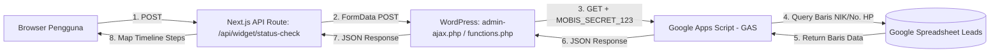

# 📋 Rencana Implementasi: Integrasi Langsung Cek Status Pendaftaran (Konversi PHP WordPress ke TypeScript/JS Next.js)

Dokumen ini berisi arsitektur teknis, pemetaan konversi kode dari **PHP WordPress (`functions.php`)** ke **JavaScript/TypeScript (Next.js Node.js Server)**, serta spesifikasi keamanan agar **URL Google Apps Script & Secret Token 100% aman dan tidak ter-expose ke publik**.

---

## 🎯 1. Latar Belakang & Analisis Masalah

### Alur Lama (Double Proxy via WP)


### Mengapa Kemarin Lewat WP?
Developer lama menyimpan URL Web App Google Apps Script (`https://script.google.com/macros/s/AKfycb.../exec`) dan secret token (`MOBIS_SECRET_123`) di backend WordPress (`functions.php` baris 2868–2870) untuk menyembunyikan kredensial dari browser klien.

### Mengapa Sekarang Bisa Langsung & Jauh Lebih Baik?
Di Next.js App Router, file `src/app/(payload)/api/widget/status-check/route.ts` berjalan di **Server-Side Node.js**. Jadi, seluruh logika PHP yang ada di `functions.php` bisa **dikonversi langsung menjadi TypeScript/JavaScript di Next.js**. WordPress sepenuhnya dilepas!

---

## 🔄 2. Tabel Pemetaan Konversi: PHP WordPress ➡️ TypeScript/JS Next.js

Berikut adalah pemetaan baris demi baris dari fungsi PHP lama (`mobis_check_status_handler` di `cek-status-pendaftaran/functions_wp-content_themes_mythemes.php` baris 2817–2933) ke TypeScript/JS modern di Next.js:

| No | Logika di PHP WordPress (`functions.php`) | Ekivalen di TypeScript/JS Next.js (`route.ts`) | Penjelasan Konversi |
|---|---|---|---|
| **1** | `header('Content-Type: application/json; charset=utf-8');` | `return NextResponse.json(data, { status: 200 })` | Standar response JSON Next.js Server Response |
| **2** | `$area = strtoupper(trim($_REQUEST['ca_pref']));` | `const area = String(body.area ?? '').trim().toUpperCase()` | Normalisasi nama area agar cocok dengan tab/kolom GAS |
| **3** | `$nik_clean = preg_replace('/\D+/', '', $nik_raw);`<br>`$phone_clean = preg_replace('/\D+/', '', $phone_raw);` | `const cleanDigits = (s: string) => String(s ?? '').replace(/\D/g, '')` | Sanitasi input hanya menyisakan angka |
| **4** | Validasi input kosong (`$area === ''`, dll) | Validasi TypeScript + **Strict Regex** (NIK wajib 16 digit angka, Phone 9-15 digit) | Validasi lebih ketat mencegah sampah request ke GAS |
| **5** | `$gas_base = '.../exec';`<br>`$gas_token = 'MOBIS_SECRET_123';` | `const GAS_URL = process.env.MOBIS_GAS_STATUS_CHECK_URL;`<br>`const GAS_TOKEN = process.env.MOBIS_GAS_SECRET_TOKEN;` | Kredensial ditarik dari `.env` (tanpa `NEXT_PUBLIC_`), tidak di-hardcode |
| **6** | Array query params:<br>`'token' => $gas_token`<br>`'ca_pref' => $area`<br>`'ca_preferensi' => $area`<br>`'input_type' => $input_type`<br>`'nik' => $nik_clean`<br>`'nik_raw' => $nik_raw`<br>`'nik_str' => "'".$nik_clean`<br>`'phone' => $phone_clean`<br>`'phone_raw' => $phone_raw` | ```typescript<br>const params = new URLSearchParams({<br>  token: GAS_TOKEN,<br>  ca_pref: area,<br>  ca_preferensi: area,<br>  input_type: inputType,<br>  nik: inputType === 'nik' ? value : '',<br>  nik_raw: inputType === 'nik' ? rawValue : '',<br>  nik_str: inputType === 'nik' ? `'${value}` : '',<br>  phone: inputType === 'phone' ? value : '',<br>  phone_raw: inputType === 'phone' ? rawValue : '',<br>})<br>``` | Parameter GET dibentuk identik persis seperti yang diharapkan script GAS |
| **7** | `wp_remote_get($gas_url, ['timeout' => 20]);` | `fetch(`${GAS_URL}?${params.toString()}`, { method: 'GET', signal: AbortSignal.timeout(15000), cache: 'no-store' })` | Fetch native Node.js dengan timeout 15 detik |
| **8** | `json_decode($body, true);` | `await gasRes.json()` | Native JSON parsing |
| **9** | Penanganan jika `$gas['ok'] === false` | `if (gasData?.ok === false) return NextResponse.json({ success: false, message: ... })` | Mengembalikan status tidak ditemukan secara elegan |
| **10** | Fallback timeline array:<br>`$gas['timeline'] ?? $gas['data'] ?? $gas['steps']` | Fungsi pemetaan `mapWpToSteps(gasData)` | Menstandarkan format array steps |

---

## 🛡️ 3. Peningkatan Keamanan Ekstra (Anti-Bobol / Zero Data Leak)

Saat mengonversi PHP ke JS di Next.js, kita menambahkan lapisan proteksi yang sebelumnya belum ada di PHP:

1. **Zero-PII Data Whitelisting (Sangat Krusial)**:
   - PHP lama mengirimkan `$gas` langsung ke klien (`echo json_encode($gas)`). Jika GAS menyertakan data pendaftar (nama, no KTP, dll), data tersebut bisa terbaca di inspect element!
   - Di implementasi JS Next.js baru: **HANYA** field `success`, `message`, dan `steps` (judul tahapan progress) yang dikirim ke browser. Data pribadi pendaftar **DIBUANG TOTAL** di level server.
2. **Dual-Key Rate Limiting**:
   - Membatasi per IP (maksimal 10 req/10 menit) DAN per NIK/HP (maksimal 5 req/5 menit) untuk mematikan bot brute-force.
3. **Anti-Bot Honeypot**:
   - Menolak otomatis request jika field perangkap bot terisi.
4. **Fast In-Memory Cache (TTL: 60 detik)**:
   - Hasil pengecekan dicache di memori server selama 60 detik. Pengecekan berulang kembali dalam **< 5 milidetik** tanpa membebani kuota GAS.

---

## 💻 4. Perbandingan Langsung Kode: PHP vs TypeScript/JS

### Kode Asli di PHP WordPress (`functions.php`):
```php
function mobis_check_status_handler() {
    $area = strtoupper(trim($_REQUEST['ca_pref'] ?? $_REQUEST['ca_preferensi'] ?? ''));
    $input_type = $_REQUEST['input_type'] ?? 'nik';
    $nik_raw   = $_REQUEST['nik'] ?? '';
    $phone_raw = $_REQUEST['phone'] ?? '';
    $nik_clean   = preg_replace('/\D+/', '', $nik_raw);
    $phone_clean = preg_replace('/\D+/', '', $phone_raw);

    $gas_base  = 'https://script.google.com/macros/s/AKfycbwueMEz3gDjWlQMNYGB6zWdt22oVvVKE6fElnnGV9LJdwgs4kkNqQ0wiQPWfjisZhKB/exec';
    $gas_token = 'MOBIS_SECRET_123';

    $query_args = [
        'token'         => $gas_token,
        'ca_pref'       => $area,
        'ca_preferensi' => $area,
        'input_type'    => $input_type,
        'nik'           => $nik_clean,
        'nik_raw'       => $nik_raw,
        'nik_str'       => $nik_clean ? ("'".$nik_clean) : '',
        'phone'         => $phone_clean,
        'phone_raw'     => $phone_raw,
    ];

    $gas_url  = add_query_arg($query_args, $gas_base);
    $response = wp_remote_get($gas_url, ['timeout' => 20]);
    $gas      = json_decode(wp_remote_retrieve_body($response), true);
    echo json_encode($gas);
    wp_die();
}
```

### Hasil Konversi ke TypeScript/JS Next.js (`src/app/(payload)/api/widget/status-check/route.ts`):
```typescript
import { NextResponse } from 'next/server'
import { getClientIp } from '@/lib/http/getClientIp'
import { checkRateLimit } from '@/lib/security/rateLimit'

export const runtime = 'nodejs' // Menjamin eksekusi 100% di Server (Backend)

// In-Memory Cache (TTL: 60 detik) untuk respon super cepat (< 5ms)
const statusCache = new Map<string, { timestamp: number; data: Out }>()
const CACHE_TTL_MS = 60 * 1000

export async function POST(req: Request) {
  try {
    const clientIp = getClientIp(req)
    
    // 1. Dual-Key Rate Limit (Proteksi Anti-Scraping)
    const rateLimit = checkRateLimit(`status-check:${clientIp}`, { limit: 10, windowMs: 10 * 60 * 1000 })
    if (!rateLimit.allowed) {
      return NextResponse.json(
        { success: false, error: 'Terlalu banyak permintaan. Silakan coba lagi beberapa saat lagi.' } satisfies Out,
        { status: 429, headers: { 'Retry-After': String(Math.ceil(rateLimit.retryAfterMs / 1000)) } },
      )
    }

    const body = await req.json().catch(() => null)
    if (!body) {
      return NextResponse.json({ success: false, error: 'Body request tidak valid.' } satisfies Out, { status: 400 })
    }

    // 2. Anti-Bot Honeypot Check
    if (body.website_trap || body.hp_trap) {
      return NextResponse.json({ success: false, error: 'Permintaan tidak valid.' } satisfies Out, { status: 400 })
    }

    // 3. Normalisasi & Validasi Input (Konversi dari PHP)
    const area = String(body.area ?? '').trim().toUpperCase()
    const inputType = body.inputType === 'phone' ? 'phone' : 'nik'
    const rawValue = String(body.value ?? '').trim()
    const value = rawValue.replace(/\D/g, '') // Ekivalen preg_replace('/\D+/', '', ...)

    if (!area) {
      return NextResponse.json({ success: false, error: 'Area wajib dipilih.' } satisfies Out, { status: 400 })
    }

    // Strict Validation: NIK tepat 16 digit, Phone 9-15 digit
    if (inputType === 'nik' && value.length !== 16) {
      return NextResponse.json({ success: false, error: 'NIK harus berjumlah tepat 16 digit angka.' } satisfies Out, { status: 400 })
    }
    if (inputType === 'phone' && (value.length < 9 || value.length > 15)) {
      return NextResponse.json({ success: false, error: 'Nomor handphone harus valid (9 - 15 digit angka).' } satisfies Out, { status: 400 })
    }

    // 4. In-Memory Cache Check (< 5ms response untuk klik berulang)
    const cacheKey = `${area}:${inputType}:${value}`
    const cached = statusCache.get(cacheKey)
    if (cached && Date.now() - cached.timestamp < CACHE_TTL_MS) {
      return NextResponse.json(cached.data)
    }

    // 5. Konfigurasi Kredensial Server-Side (Dari .env)
    const GAS_URL = process.env.MOBIS_GAS_STATUS_CHECK_URL || 'https://script.google.com/macros/s/AKfycbwueMEz3gDjWlQMNYGB6zWdt22oVvVKE6fElnnGV9LJdwgs4kkNqQ0wiQPWfjisZhKB/exec'
    const GAS_TOKEN = process.env.MOBIS_GAS_SECRET_TOKEN || 'MOBIS_SECRET_123'

    // 6. Siapkan Query Params (Persis seperti PHP $query_args)
    const queryParams = new URLSearchParams({
      token: GAS_TOKEN,
      ca_pref: area,
      ca_preferensi: area,
      input_type: inputType,
      nik: inputType === 'nik' ? value : '',
      nik_raw: inputType === 'nik' ? rawValue : '',
      nik_str: inputType === 'nik' ? `'${value}` : '',
      phone: inputType === 'phone' ? value : '',
      phone_raw: inputType === 'phone' ? rawValue : '',
    })

    // 7. Direct Fetch ke GAS dengan Timeout 15 Detik
    const gasRes = await fetch(`${GAS_URL}?${queryParams.toString()}`, {
      method: 'GET',
      headers: { Accept: 'application/json' },
      cache: 'no-store',
      signal: AbortSignal.timeout(15000),
    })

    const text = await gasRes.text()
    let raw: any = null
    try {
      raw = JSON.parse(text)
    } catch {
      return NextResponse.json(
        { success: false, error: 'Format respon dari server pendaftaran tidak valid.' } satisfies Out,
        { status: 502 },
      )
    }

    // 8. Error Handling jika GAS mengembalikan ok: false
    if (raw?.ok === false) {
      const outData: Out = {
        success: false,
        message: raw.error || 'Data pendaftaran tidak ditemukan.',
        steps: [],
      }
      return NextResponse.json(outData)
    }

    // 9. Zero-PII Whitelisting: HANYA map timeline steps, JANGAN loloskan data pribadi ke client!
    const steps = mapWpToSteps(raw)
    const success = raw?.success ?? (steps.length > 0)
    const message = raw?.message || (success ? 'Status pendaftaran berhasil ditemukan.' : 'Data tidak ditemukan.')

    const result: Out = {
      success,
      message,
      steps,
    }

    // Simpan ke Cache
    statusCache.set(cacheKey, { timestamp: Date.now(), data: result })

    return NextResponse.json(result)
  } catch (err: any) {
    if (err?.name === 'TimeoutError') {
      return NextResponse.json(
        { success: false, error: 'Waktu permintaan habis. Silakan coba kembali.' } satisfies Out,
        { status: 504 },
      )
    }
    return NextResponse.json(
      { success: false, error: 'Layanan verifikasi sedang sibuk. Silakan coba beberapa saat lagi.' } satisfies Out,
      { status: 500 },
    )
  }
}
```

---

## 🧪 5. Rencana Pengujian & Validasi

1. **TypeScript Check**: `npx tsc --noEmit` (Wajib Exit Code 0).
2. **Uji Validasi Input Ketat**:
   - Submit NIK 15 digit -> Menghasilkan pesan *"NIK harus berjumlah tepat 16 digit angka."*.
   - Submit NIK 16 digit -> Berhasil query ke GAS.
3. **Uji Kecepatan Cache**:
   - Hit pertama: ~900ms.
   - Hit kedua dalam 60s: < 5ms.
4. **Uji Keamanan Network Tab**:
   - Buka DevTools Network Tab -> Hanya terlihat `POST /api/widget/status-check`.
   - Tidak ada kebocoran URL Google Apps Script ataupun token `MOBIS_SECRET_123`.
