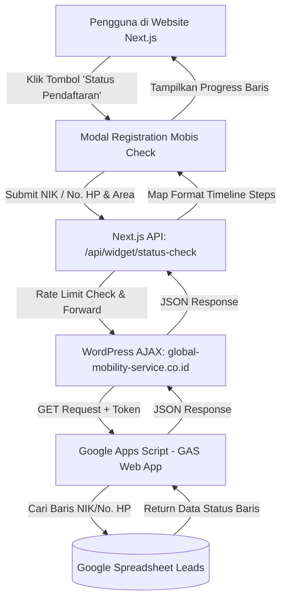

# Panduan & Dokumentasi Fitur: Status Pendaftaran & Integrasi Google Sheets

Dokumentasi ini merangkum secara lengkap cara kerja, kode WordPress lama, endpoint Google Apps Script, daftar Google Spreadsheet (Production & Staging), kredensial/token, serta rincian nomor baris kode pada fitur **Pengecekan Status Pendaftaran Mobis**.

---

## 🏗️ 1. Diagram Alur Sistem (End-to-End)



> **Catatan Arsitektur:**
> File `functions.php` di WordPress (meskipun berada di folder tema) adalah **Server-Side PHP Script (Backend)**, bukan frontend. Endpoint `/wp-admin/admin-ajax.php` di server WordPress mengeksekusi fungsi handler di `functions.php` saat menerima request dari Next.js.

---

## 📍 2. Rincian Baris Kode di WordPress Lama

File sumber di server WordPress:
`/home/gmsindonesia/CompanyProfile-production/global-mobility-service.co.id/src/wp-content/themes/<active-theme>/functions.php`  
*(Salinan lokal: `cek-status-pendaftaran/functions_wp-content_themes_mythemes.php`)*

Kode fitur status pendaftaran berada di **Baris 2814 sampai 2943**, dengan rincian per bagian:

| Baris ke- | Bagian / Fungsi Kode | Penjelasan Logika |
| :--- | :--- | :--- |
| **2814 – 2815** | `add_action('wp_ajax_mobis_check_status', ...)` | Mendaftarkan endpoint AJAX publik agar dapat dipanggil dari luar tanpa perlu login WordPress |
| **2817 – 2818** | `function mobis_check_status_handler()` | Awal definisi fungsi handler backend dan set header `application/json` |
| **2820 – 2830** | Ekstraksi & Normalisasi Area | Mengambil nilai parameter `ca_pref` / `ca_preferensi` dan mengubahnya menjadi huruf kapital (`strtoupper`) |
| **2831 – 2843** | Ekstraksi & Sanitasi NIK/HP | Membersihkan input `nik` dan `phone` sehingga hanya tersisa digit angka (`preg_replace('/\D+/', '', ...)`) |
| **2844 – 2866** | Validasi Input | Mengecek kelengkapan input; mengembalikan pesan error JSON jika area atau NIK/No. HP kosong |
| **2868 – 2870** | Konfigurasi Google Apps Script (GAS) | URL endpoint Web App GAS dan Secret Token (`MOBIS_SECRET_123`) |
| **2873 – 2886** | Pengiriman Request ke GAS | Membungkus query params (`token`, `ca_pref`, `nik`, `phone`) dan menembak URL GAS via `wp_remote_get()` |
| **2888 – 2908** | Error Handling & JSON Parsing | Menangani kegagalan koneksi cURL / format JSON respon dari Google Apps Script |
| **2910 – 2933** | Output JSON Response | Menyiapkan data `timeline` / `steps` dan mengirimkan JSON kembali ke pemanggil (`wp_die()`) |
| **2936 – 2942** | Script Enqueue & Nonce | Pendaftaran nonce security `mobis_check_status_nonce` untuk kompatibilitas frontend lama |

---

## 🔑 3. Kredensial, Token & Endpoint Terkait

> [!IMPORTANT]
> Simpan dan gunakan informasi kredensial ini hanya untuk keperluan internal pengelolaan sistem Mobis.

### A. Endpoint & Token Google Apps Script (GAS)
Digunakan oleh WordPress untuk query data ke Google Spreadsheet:

| Item | Nilai / URL | Keterangan |
| :--- | :--- | :--- |
| **GAS URL (Active)** | `https://script.google.com/macros/s/AKfycbwueMEz3gDjWlQMNYGB6zWdt22oVvVKE6fElnnGV9LJdwgs4kkNqQ0wiQPWfjisZhKB/exec` | Terletak di baris **2868** |
| **GAS URL (Cadangan)** | `https://script.google.com/macros/s/AKfycbzIAMBnRpUJ6H7-wRVJkjBkXkCenQnYofLlmtE_re1hIUm0lpvU2sgghcrBBwRYldP4/exec` | Terletak di baris **2869** (komentar) |
| **GAS Secret Token** | `MOBIS_SECRET_123` | Terletak di baris **2870** |

---

### B. Service Account Google (Website Baru Next.js)
Digunakan oleh Next.js untuk menulis (*append*) data pendaftaran baru langsung ke Google Sheets:

| Item | Nilai | Keterangan |
| :--- | :--- | :--- |
| **Client Email** | `gmsi-connect-sheet-api@gmsi-305303.iam.gserviceaccount.com` | Email Service Account Google Cloud |
| **Credential Path** | `src/private/secrets/credentials.json` | File kunci privat JSON service account |
| **Nama Sheet Tab** | `Leads` | Nama tab default tempat data disimpan |

---

## 📊 4. Daftar Link Google Spreadsheet

### 🌐 Google Spreadsheet Production (Live)

| Area | Environment Variable | Link Akses Spreadsheet |
| :--- | :--- | :--- |
| **Jabodetabek & Default** | `GOOGLE_SHEETS_SPREADSHEET_ID_JABODETABEK` | 🔗 [Buka Sheet Jabodetabek (Production)](https://docs.google.com/spreadsheets/d/1oUBhDOLlsQ2jSw5qYT9NITu0d0VPLEPhn1zwpJHiJ3Y/edit) |
| **Bandung** | `GOOGLE_SHEETS_SPREADSHEET_ID_BANDUNG` | 🔗 [Buka Sheet Bandung (Production)](https://docs.google.com/spreadsheets/d/133BpHSTkcAdHKaY0SLab4SPBH7qKjYoMXEitra8QoPg/edit) |
| **Surabaya** | `GOOGLE_SHEETS_SPREADSHEET_ID_SURABAYA` | 🔗 [Buka Sheet Surabaya (Production)](https://docs.google.com/spreadsheets/d/1q2MHNnL-J28OcYbBETsI9uUuhqM5ty33UGr_f7D8yYo/edit) |
| **Bali** | `GOOGLE_SHEETS_SPREADSHEET_ID_BALI` | 🔗 [Buka Sheet Bali (Production)](https://docs.google.com/spreadsheets/d/1qW_Jt4uCL37QYTO6xzztILba6ixNeOuWArcDrXVDOa8/edit) |
| **Malang** | `GOOGLE_SHEETS_SPREADSHEET_ID_MALANG` | 🔗 [Buka Sheet Malang (Production)](https://docs.google.com/spreadsheets/d/1J8NJZj-RROMDCf6tIlEgzHtrcEB3BjFnrf4yFBHmYxs/edit) |

---

### 🧪 Google Spreadsheet Staging (Uji Coba)

| Area | Environment Variable | Link Akses Spreadsheet |
| :--- | :--- | :--- |
| **Jabodetabek & Default** | `GOOGLE_SHEETS_SPREADSHEET_ID_DEFAULT` | 🔗 [Buka Sheet Jabodetabek (Staging)](https://docs.google.com/spreadsheets/d/1KWzdSW7PM1xoIXt8EHg5nxUS_bujtUIW0GEyQV6p2VE/edit) |
| **Bandung** | `GOOGLE_SHEETS_SPREADSHEET_ID_BANDUNG` | 🔗 [Buka Sheet Bandung (Staging)](https://docs.google.com/spreadsheets/d/1ubhMxgk2c-jV8vzkzMHXGcAM1K2p27caYWHo35uf1zI/edit) |

---

## 💻 5. Pemetaan File di Proyek Website Baru (Next.js)

| Bagian | Path File | Keterangan |
| :--- | :--- | :--- |
| **Tombol Melayang** | `src/components/MobisWidget/widgets/FloatingButtons/FloatingButtons.tsx` | Tombol kuning *"Status Pendaftaran"* di pojok kanan bawah |
| **Modal UI Pengecekan** | `src/components/MobisWidget/widgets/StatusRegistration/StatusModal.tsx` | Modal form input data & visualisasi progress card |
| **API Proxy Handler** | `src/app/(payload)/api/widget/status-check/route.ts` | Endpoint Next.js yang mem-forward request ke WordPress AJAX |
| **Koleksi Database Lokal** | `src/collections/Customers/Customers.ts` | Skema penyimpanan data pendaftar di PostgreSQL lokal Payload CMS |
| **Service Append ke Sheet** | `src/services/googleSheets/appendLead.ts` | Service integrasi Google Sheets API via Service Account |

---

## 🧪 6. Cara Pengujian (Testing)

### Opsi A: Lewat Frontend UI
1. Jalankan server lokal: `pnpm dev`
2. Buka `http://localhost:3000` di browser.
3. Klik tombol melayang kuning **"Status Pendaftaran"** di pojok kanan bawah.
4. Masukkan **Area** dan **NIK / No. HP** yang sudah ada di spreadsheet Leads.
5. Klik **"Check Status Pendaftaran"**.

### Opsi B: Lewat Terminal (cURL)
```bash
curl -X POST http://localhost:3000/api/widget/status-check \
  -H "Content-Type: application/json" \
  -d "{\"area\":\"JABODETABEK\",\"inputType\":\"nik\",\"value\":\"3201010000000001\"}"
```

---

## 🛠️ 7. Cara Mengakses Script Google Apps Script Langsung

1. Buka salah satu link Google Spreadsheet Production di atas (misal [Sheet Jabodetabek](https://docs.google.com/spreadsheets/d/1oUBhDOLlsQ2jSw5qYT9NITu0d0VPLEPhn1zwpJHiJ3Y/edit)).
2. Di menu bar Google Sheet, klik **Extensions (Ekstensi)** ➡️ **Apps Script**.
3. Kode pencarian baris dan pembentukan JSON timeline status akan terbuka di editor Google Apps Script.
4. Setiap ada perubahan pada script, lakukan deploy ulang: **Deploy** ➡️ **Manage Deployments** ➡️ **Edit (ikon pensil)** ➡️ **New version** ➡️ **Deploy**.
